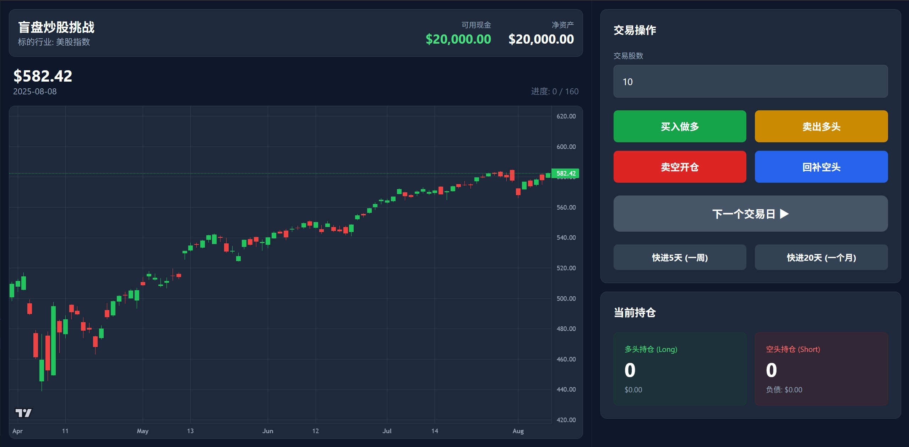
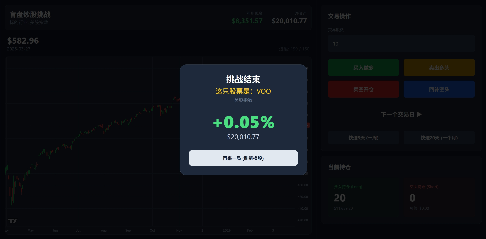

# Loss Money Simulator

> 📉 真实股票历史K线盲盘交易模拟器｜无虚假数据｜多空双向交易｜Docker一键部署

基于**真实美股K线数据**的盲盘炒股挑战游戏，隐藏股票代码仅展示行业，支持自定义股数、多空双向交易、快进时间，纯Django+轻量金融图表实现，开箱即用。

## ✨ 核心功能

- 📊 **真实蜡烛图（K线）**：仅使用 Yahoo Finance 真实历史数据，**无任何模拟/虚假数据**
- 🔄 **多空双向交易**：支持买入做多 / 卖出平仓 / 卖空开仓 / 回补空头
- 🎯 **自定义交易股数**：自由指定每次买卖数量，非强制满仓
- ⏩ **快速时间跳转**：下一日 / 快进5天（一周）/ 快进20天（一月）
- 🎨 **专业交易界面**：左侧K线走势 + 右侧操作面板，一屏可视无需滚动
- 🚢 **Docker 一键部署**：基于 Python 3.14 + uv 包管理器，跨环境零配置
- 🏆 **结算复盘**：游戏结束展示真实股票代码、行业与收益率

## 📸 项目截图

| 初始化游戏界面                      | 结算复盘界面                    |
| ----------------------------------- | ------------------------------- |
|  |  |

## 🚀 在线 Demo

[https://simulator.cloud-down.com/](https://simulator.cloud-down.com/)

## 🛠️ 技术栈

- **后端**: Django 5.x
- **包管理**: uv（极速 Python 包管理器）
- **数据来源**: yfinance（真实美股历史K线）
- **前端图表**: Lightweight Charts（TradingView 官方金融图表）
- **部署**: Docker + Gunicorn
- **Python 版本**: 3.14

## 🐳 Docker 一键部署（推荐）

### 1. 拉取/构建镜像

```bash
# 构建本地镜像
docker build -t loss-money-simulator .
```

### 2. 启动容器（暴露 8000 端口）

```bash
docker run -d \
  -p 8000:8000 \
  --restart always \
  --name loss-money-simulator \
  loss-money-simulator
```

### 3. 访问应用

打开浏览器访问：

```
http://localhost:8000
```

### 4. 容器管理

```bash
# 查看运行日志
docker logs -f loss-money-simulator

# 停止容器
docker stop loss-money-simulator

# 重启容器
docker restart loss-money-simulator
```

## 📝 本地开发运行

```bash
# 安装依赖（uv）
uv sync

# 数据库迁移
uv run python manage.py migrate

# 启动开发服务器
uv run python manage.py runserver
```

## 📄 许可证

Apache License 2.0

---

**免责声明**：本项目仅用于交易学习与娱乐，所有数据来源于公开市场，不构成任何投资建议。
